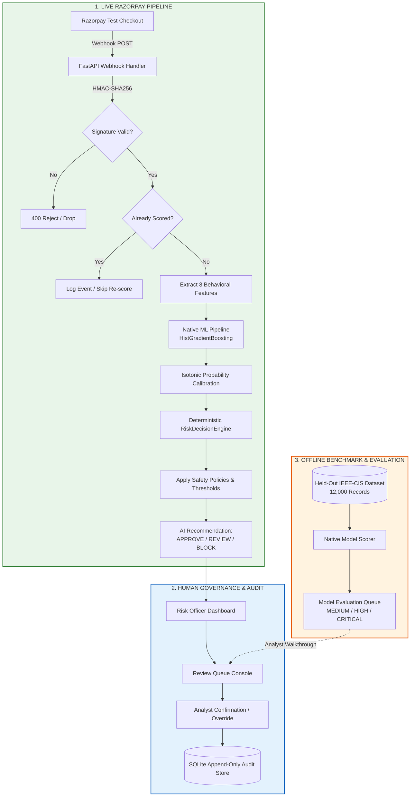

# RazorRisk — AI Risk Manager for Payment Fraud

> An intelligent, fail-safe payment fraud risk management platform that combines machine learning risk scoring, deterministic safety policies, and human-in-the-loop governance for real-time Razorpay transactions.

---

### **Razorpay AI Buildathon 2026**
- **Track**: Track 02 — AI Risk Manager
- **Status**: Working Prototype (Production-Grade Architecture)
- **Author**: Sumukha P Kashyap
- **Demo Video**: [Demo Video — ADD LINK]
- **Core Tech Stack**: Python 3.13, FastAPI, scikit-learn, Razorpay API, SQLite, Tailwind CSS, Chart.js, pytest

---

## 1. The Problem

Online payment fraud imposes direct financial loss from chargebacks and substantial operational friction from manual investigation. Merchants need a system that evaluates transaction risk in real time before actions are finalized. 

**RazorRisk** solves this by evaluating payment risk on incoming webhook events, combining calibrated machine learning with deterministic safety policies and explicit human confirmation before taking irreversible merchant actions.

---

## 2. What RazorRisk Does

RazorRisk intercepts payment events, scores fraud probability, evaluates confidence, enforces safety policies, and presents clear recommendations to human risk analysts.

```
Razorpay Test Payment
        ↓
Verified Webhook (HMAC-SHA256)
        ↓
Native ML Risk Score (HistGradientBoosting)
        ↓
Calibration + Confidence (Isotonic Regression)
        ↓
Deterministic Risk Policy (RiskDecisionEngine)
        ↓
AI Recommendation (APPROVE / REVIEW / BLOCK)
        ↓
Human Confirmation (Risk Officer Console)
        ↓
Immutable Audit Trail (SQLite WAL Store)
```

> **Key Architectural Principle**: The AI model **recommends** an action; it does not silently execute final merchant decisions. The human risk analyst retains final authority, and all actions are recorded in an append-only audit trail.

---

## 3. Live Demo Workflow

The live workflow processes genuine transactions generated through Razorpay Test Mode:

1. **Order Creation**: Merchant initializes a test order via the built-in Checkout Sandbox (`/test-checkout`).
2. **Payment Completion**: The user completes payment in the Razorpay Test Modal (Cards, NetBanking, UPI).
3. **Webhook Verification**: FastAPI receives `payment.authorized`, `order.paid`, or `payment.captured` webhooks and verifies HMAC-SHA256 signatures using constant-time comparisons.
4. **Context Extraction**: Transaction features (amount, hour, day, attempts, card network, card type, email domain, international status) are extracted from raw webhook payloads.
5. **Native ML Scoring**: Features are evaluated through the native pipeline (`razorrisk_native_pipeline.joblib`).
6. **Policy Evaluation**: The deterministic `RiskDecisionEngine` assigns a risk tier (`LOW`, `MEDIUM`, `HIGH`, `CRITICAL`) and recommended action (`APPROVE`, `REVIEW`, `BLOCK`).
7. **Human Oversight**: Risk analysts review flagged payments in the Review Queue (`#review-queue`) and confirm or override decisions with mandatory reason codes.
8. **Audit Logging**: The decision and analyst justification are committed as immutable audit records.

> **Note on Sandbox Distribution**: Real Razorpay Test Mode transactions legitimately occupy the low-risk region of the model's feature space (normal test cards, low attempt velocities, valid sandbox issuers). Offline evaluation records are provided separately to demonstrate the full risk lifecycle.

---

## 4. Model & Evaluation

RazorRisk operates across two clearly separated evaluation contexts:

### A. Live Razorpay Test Mode
- Processes live sandbox transactions initiated via merchant checkout.
- Reflects realistic sandbox behavior where transactions default to low/medium risk.
- Idempotently scored across multi-stage webhook deliveries (`payment.authorized`, `order.paid`, `payment.captured`).

### B. Offline Held-Out Evaluation Split
- Evaluated on a 12,000-record held-out test split from the verified IEEE-CIS Fraud Detection dataset using mapped behavioral features.
- Demonstrates the model's ability to span the entire risk spectrum:

| Risk Tier | Record Count | % of Held-Out Data | Primary AI Recommendation |
| :--- | :--- | :--- | :--- |
| **LOW** | 11,624 | 96.87% | **APPROVE** |
| **MEDIUM** | 299 | 2.49% | **REVIEW** |
| **HIGH** | 38 | 0.32% | **BLOCK** |
| **CRITICAL** | 39 | 0.32% | **BLOCK** |

#### Representative Held-Out Evaluation Cases in Model Evaluation Queue:

| Evaluation ID | Risk Score | AI Recommendation | Ground Truth | Context & Features |
| :--- | :--- | :--- | :--- | :--- |
| `EVAL-IEEE-00048` | **`0.1691`** | **REVIEW** | Non-Fraud | Amount: $42.29, Visa Debit, 1 attempt, `is_international=1`, `outlook.com` |
| `EVAL-IEEE-07876` | **`0.7562`** | **BLOCK** | Fraud | Amount: $41.33, Mastercard Credit, **23 attempts**, `is_international=1`, missing domain |
| `EVAL-IEEE-01069` | **`1.0000`** | **BLOCK** | Fraud | Amount: $90.87, Visa Credit, **40 attempts**, `is_international=1`, `gmail.com` |

> *All three cases are permanently labeled `OFFLINE / HELD-OUT IEEE-CIS` in the UI to ensure strict separation from live Razorpay transactions.*

---

## 5. Model Metrics

The native risk model was trained on 60,000 records from the IEEE-CIS Fraud Detection dataset with isotonic probability calibration:

| Metric | Native Model (IEEE-CIS Mapped) | ULB Benchmark Reference |
| :--- | :--- | :--- |
| **PR-AUC (Primary Metric)** | **0.3153** | 0.7866 |
| **ROC-AUC** | **0.8220** | 0.9595 |
| **Precision** | **0.4853** (at threshold 0.20) | 0.8718 |
| **Recall** | **0.2450** (at threshold 0.20) | 0.6538 |
| **F1-Score** | **0.3257** | 0.7473 |
| **Calibration Method** | Isotonic Regression | Isotonic Calibrated Classifier |
| **Training Records** | 60,000 | 227,845 |
| **Validation Sample** | 15,000 (Held-Out) | 56,962 (Held-Out) |

> **Why PR-AUC is Primary**: In payment fraud detection, genuine fraud accounts for <3% of transactions. Precision-Recall AUC (PR-AUC) evaluates classifier performance specifically on the positive (fraud) class without being inflated by overwhelming true negatives.
>
> *Disclaimer: All metrics reflect public benchmark evaluations. RazorRisk makes no claims of "production fraud accuracy" on unlabelled proprietary Razorpay merchant networks.*

---

## 6. Risk Decision Engine

The `RiskDecisionEngine` is a deterministic rule and policy engine that converts calibrated probabilities into actionable operational tiers:

| Risk Tier | Probability Range | Default Policy Action | Operational Meaning |
| :--- | :--- | :--- | :--- |
| **LOW** | `p < 0.10` | **APPROVE** | Transaction appears normal. Automated approval recommended. |
| **MEDIUM** | `0.10 ≤ p < 0.34` | **REVIEW** | Some risk signals detected. Requires human analyst inspection. |
| **HIGH** | `0.34 ≤ p < 0.80` | **BLOCK** | Strong fraud indicators detected. Recommend blocking payment. |
| **CRITICAL** | `p ≥ 0.80` | **BLOCK** | Extremely high-confidence fraud risk. Immediate block recommended. |

> *"Risk tier describes assessed risk. Final action requires human confirmation."*

### Policy Safety Mechanisms
1. **Uncertainty Downgrade**: If epistemic uncertainty exceeds `0.30`, high-risk automated actions are downgraded to `REVIEW` to avoid false-positive merchant blocks.
2. **Fail-Closed Fallback**: If input features are missing, unparseable, or outside the supported schema, the engine returns `action = REVIEW` with reason `MODEL_NOT_APPLICABLE_ESCALATE_TO_MANUAL_REVIEW`. It never silently guesses or fabricates features.

---

## 7. Security & Hardening

RazorRisk has been tested against automated adversarial suites:

- **142 Automated Tests Passing** (100% test baseline)
- **48 Dedicated Security & Adversarial Tests Passing**

### Verified Security Protections

| Protection Layer | Implementation Mechanism |
| :--- | :--- |
| **Webhook Signature Verification** | HMAC-SHA256 verification using `hmac.compare_digest` to prevent timing attacks. |
| **Replay & Idempotency** | Webhook delivery idempotency key cache with TTL preventing replay attacks. |
| **Duplicate Scoring Deduplication** | Single scoring event per payment ID across `authorized`, `paid`, and `captured` events. |
| **Secret Protection** | Zero secrets in repository; environment variable isolation via `pydantic-settings`. |
| **SQL Injection Defense** | Parameterized queries on all SQLite audit and transaction tables. |
| **Frontend XSS Sanitization** | Explicit HTML escaping of all user and external webhook inputs rendered in the DOM. |
| **Fail-Closed Architecture** | Unrecognized payloads and invalid signatures safely reject or route to manual review. |
| **LLM / Prompt-Injection Guard** | Deterministic policy decision engine cannot be overridden by string injection payloads. |
| **Audit Immutability** | Append-only SQLite event log preserving original automated risk scores alongside analyst overrides. |

---

## 8. System Architecture



---

## 9. Project Structure

```
RazorRisk/
├── app/
│   ├── api/
│   │   └── routes/
│   │       ├── audit.py            # Audit log query and export endpoints
│   │       ├── checkout.py         # Test checkout order generation & sandbox
│   │       ├── dashboard.py        # Real-time metrics, risk distribution & KPI APIs
│   │       ├── model.py            # ML inference & benchmark performance APIs
│   │       ├── review.py           # Review queue & analyst decision endpoints
│   │       ├── system.py           # Health checks & service status
│   │       ├── transactions.py     # Transaction monitoring APIs
│   │       └── webhooks.py         # Razorpay HMAC verification & event ingestion
│   ├── core/
│   │   ├── dependencies.py         # FastAPI dependency injection
│   │   └── security.py             # Signature verification & rate limiting
│   ├── schemas/                    # Pydantic data contracts & validation schemas
│   ├── static/                     # Vanilla JS & Tailwind CSS Single-Page Application
│   │   ├── checkout/               # Razorpay Standard Checkout sandbox UI
│   │   └── dashboard/              # Risk Analyst Operations Dashboard
│   ├── storage/
│   │   └── audit_store.py          # SQLite WAL append-only audit repository
│   ├── config.py                   # Environment settings & configuration
│   └── main.py                     # FastAPI application entry point
├── docs/                           # Architectural specifications & experiment reports
├── experiments/                    # Model training, calibration & benchmark scripts
├── models/
│   ├── offline_risk_coverage.json  # 12,000-record held-out evaluation baseline
│   ├── razorrisk_native_metrics.json # IEEE-CIS model evaluation metrics
│   ├── razorrisk_native_pipeline.joblib # Native ML pipeline artifact
│   └── razorrisk_random_forest_pipeline.joblib # ULB reference benchmark artifact
├── razorrisk/
│   ├── engine/
│   │   ├── decision.py             # Decision orchestration & fail-safe logic
│   │   └── rules.py                # Deterministic threshold definitions
│   └── ml/
│       ├── evaluator.py            # Calibration & uncertainty estimation
│       ├── model.py                # Scikit-learn inference wrapper
│       └── native_pipeline.py      # Raw webhook feature extraction pipeline
├── storage/
│   └── .gitkeep                    # SQLite database directory anchor
├── tests/                          # 142 automated unit, integration & security tests
├── .env.example                    # Configuration template (no secrets)
├── .gitignore                      # Git exclusion rules
├── README.md                       # Repository documentation
└── requirements.txt                # Python package dependencies
```

---

## 10. Quick Start

### Prerequisites
- Python 3.10+ (tested on Python 3.13)
- Git

### Installation

```bash
# 1. Clone the repository
git clone https://github.com/Sumu082005/razorrisk1.git
cd razorrisk1

# 2. Create and activate virtual environment
# Windows:
python -m venv .venv
.venv\Scripts\activate

# Linux / macOS:
python3 -m venv .venv
source .venv/bin/activate

# 3. Install dependencies
pip install -r requirements.txt

# 4. Set up environment variables
cp .env.example .env
# Edit .env with your Razorpay Test Mode keys if running live checkout
```

### Running the Application

```bash
# Start the FastAPI server
python -m uvicorn app.main:app --reload --port 8000
```

- **Risk Analyst Dashboard**: [http://127.0.0.1:8000](http://127.0.0.1:8000)
- **Interactive Checkout Sandbox**: [http://127.0.0.1:8000/test-checkout](http://127.0.0.1:8000/test-checkout)
- **API Documentation**: [http://127.0.0.1:8000/docs](http://127.0.0.1:8000/docs)

### Running Automated Tests

```bash
# Run complete test suite (142 tests)
python -m pytest

# Run dedicated security & adversarial suite (48 tests)
python -m pytest tests/test_security_and_adversarial.py
```

---

## 11. Razorpay Test Mode Integration

RazorRisk is integrated with **Razorpay Test Mode**:

1. **Test Mode Credentials**: Uses Razorpay test key pair (`rzp_test_*`) with zero real currency movement.
2. **Webhook Verification**: Verifies incoming webhooks using the shared secret configured in the Razorpay Dashboard.
3. **Supported Events**:
   - `payment.authorized`
   - `payment.captured`
   - `payment.failed`
   - `order.paid`
4. **Local Webhook Forwarding**: When testing locally, forward Razorpay webhooks using the Razorpay CLI or ngrok:
   ```bash
   ngrok http 8000
   # Configure Webhook URL in Razorpay Dashboard: https://<your-subdomain>.ngrok-free.app/api/webhooks/razorpay
   ```

---

## 12. Design Decisions & Engineering Lessons

| Problem Encountered | Root Cause | Engineering Solution |
| :--- | :--- | :--- |
| **Duplicate Event Scoring** | Razorpay emits multiple webhooks for a single checkout flow (`payment.authorized`, `order.paid`, `payment.captured`). | Implemented transaction-level scoring deduplication in `audit_store.py`. Only the initial event triggers model evaluation; subsequent events are logged as audit confirmations without re-scoring. |
| **Sandbox Feature Distribution** | Razorpay sandbox checkouts produce clean, non-fraudulent feature sets that consistently score as `LOW`. | Implemented a dedicated **Model Evaluation Queue** using 12,000 held-out IEEE-CIS records to demonstrate `MEDIUM`, `HIGH`, and `CRITICAL` review workflows cleanly without fabricating fake live payments. |
| **Probability Calibration** | Raw gradient-boosted tree margin outputs clustered near zero and one, distorting threshold boundaries. | Fitted an **Isotonic Regression** calibrator on validation fold probabilities to ensure scores reflect empirical posterior probabilities. |
| **Frontend XSS Vulnerabilities** | Raw webhook fields (e.g., email, payment notes) rendered directly into the DOM posed injection risks. | Implemented strict HTML entity escaping (`escapeHtml()`) across all dynamic dashboard and review queue rendering components. |
| **Pydantic Type Coercion** | Permissive type casting allowed malformed numeric inputs to pass through silent defaults. | Enforced strict validation schemas and fail-closed validation fallbacks in `app/schemas/`. |
| **Human-in-the-Loop Governance** | Automated blocking without merchant oversight risked catastrophic false-positive customer churn. | Decoupled AI recommendation (`APPROVE`/`REVIEW`/`BLOCK`) from merchant execution. Human analyst confirmation is mandatory. |

---

## 13. Limitations

1. **Benchmark vs. Production Labels**: The ML model was trained on the public IEEE-CIS Fraud Detection dataset. Benchmark patterns may differ from proprietary production traffic across diverse Indian merchant segments.
2. **Sandbox Traffic Diversity**: Razorpay Test Mode cannot simulate malicious botnets, stolen card networks, or device emulator fingerprints.
3. **Database Architecture**: SQLite WAL mode provides excellent durability for a prototype, but a distributed production deployment would require PostgreSQL with Redis caching.
4. **Synchronous Inference**: Feature extraction and scoring run synchronously on webhook arrival; enterprise scale would decouple ingestion via Apache Kafka / Celery queues.
5. **Feature Mapping**: Webhook-to-dataset feature alignment is a behavioral approximation (e.g., payment attempts mapped to transaction count features).

---

## 14. Future Work

- **Distributed Event Queue**: Integrate Redis Streams / Kafka for asynchronous webhook processing under high concurrency.
- **Merchant Velocity Features**: Real-time sliding window aggregations across merchant IDs, card fingerprints, and IP subnets.
- **Continual Calibration & Drift Detection**: Automated Population Stability Index (PSI) monitoring to detect data drift.
- **Advanced Graph Risk Signals**: Card-to-device identity clustering to detect coordinated fraud syndicates.

---

## 15. Technology Stack

| Component | Technology | Version / Specification |
| :--- | :--- | :--- |
| **Backend Framework** | FastAPI | 0.115.0+ (ASGI) |
| **ASGI Web Server** | Uvicorn | 0.30.0+ |
| **Machine Learning** | scikit-learn | 1.5.0+ (HistGradientBoosting, Isotonic) |
| **Data Processing** | Pandas, NumPy | 2.2.0+, 1.26.0+ |
| **Model Serialization** | Joblib | 1.4.0+ |
| **Payment Gateway** | Razorpay Python SDK | 1.4.0+ (Test Mode) |
| **Storage & Audit** | SQLite (WAL Mode) | Python built-in `sqlite3` |
| **Configuration** | Pydantic Settings | 2.4.0+ |
| **Frontend** | Vanilla JavaScript / CSS | Tailwind CSS (CDN), Chart.js |
| **Testing & QA** | pytest, pytest-mock | 8.0.0+, 3.14.0+ (142 Tests) |

---

## 16. Author & Submission

- **Author**: **Sumukha P Kashyap**
- **Event**: **Razorpay AI Buildathon 2026**
- **Track**: **Track 02 — AI Risk Manager**
- **Repository**: [https://github.com/Sumu082005/RazorRisk-AI-Powered-Payment-Risk-Manager](https://github.com/Sumu082005/RazorRisk-AI-Powered-Payment-Risk-Manager)
