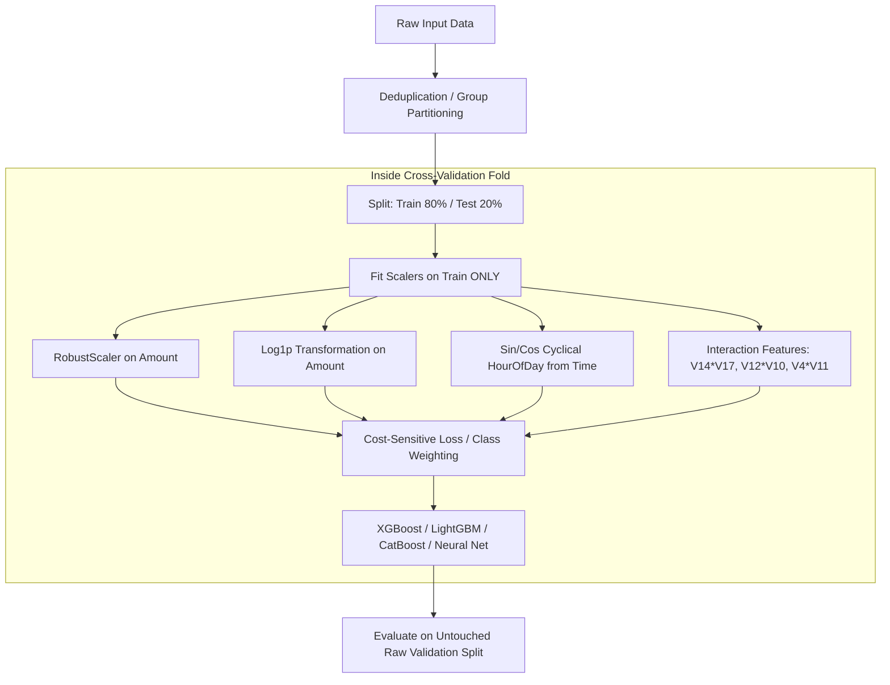

# RazorRisk — Dataset Audit & Technical Discovery Report
**Project:** RazorRisk (Razorpay AI Buildathon 2026 — AI Risk Manager Track)  
**Lead Role:** ML / Data Science Lead  
**Audit Target:** ULB Credit Card Fraud Detection Benchmark Dataset  
**Audit Date:** August 26, 2026  
**Status:** Complete & Verified (Reproducible)

---

## Executive Summary

This document presents a comprehensive, empirical audit of the primary dataset provided for **RazorRisk**. The dataset consists of anonymized credit card transactions made by European cardholders in September 2013 over a 48-hour window. The audit reveals an **extreme class imbalance** (0.173% fraud), significant feature skewness in transaction amounts and PCA components, 1,081 exact duplicate records, and key structural properties that dictate our validation framework, preprocessing pipeline, and model evaluation metrics.

---

## 1. Exact Dataset Filename
- **Filename:** `creditcard.csv`
- **File Size:** `150,828,752 bytes` (~143.84 MB on disk)
- **Format:** Comma-Separated Values (CSV), UTF-8 encoded text

---

## 2. Number of Rows
- **Total Rows:** `284,807` records (transactions)

---

## 3. Number of Columns
- **Total Columns:** `31` features (30 predictive features + 1 ground truth target)

---

## 4. Every Column and Datatype

| # | Column Name | Pandas Dtype | Non-Null Count | Null Count | Unique Values | Description / Semantics |
|---|-------------|--------------|----------------|------------|---------------|-------------------------|
| 0 | `Time` | `float64` | 284,807 | 0 | 124,592 | Seconds elapsed since the first transaction in dataset |
| 1 | `V1` | `float64` | 284,807 | 0 | 275,663 | 1st Principal Component (anonymized) |
| 2 | `V2` | `float64` | 284,807 | 0 | 275,663 | 2nd Principal Component (anonymized) |
| 3 | `V3` | `float64` | 284,807 | 0 | 275,663 | 3rd Principal Component (anonymized) |
| 4 | `V4` | `float64` | 284,807 | 0 | 275,663 | 4th Principal Component (anonymized) |
| 5 | `V5` | `float64` | 284,807 | 0 | 275,663 | 5th Principal Component (anonymized) |
| 6 | `V6` | `float64` | 284,807 | 0 | 275,663 | 6th Principal Component (anonymized) |
| 7 | `V7` | `float64` | 284,807 | 0 | 275,663 | 7th Principal Component (anonymized) |
| 8 | `V8` | `float64` | 284,807 | 0 | 275,663 | 8th Principal Component (anonymized) |
| 9 | `V9` | `float64` | 284,807 | 0 | 275,663 | 9th Principal Component (anonymized) |
| 10 | `V10` | `float64` | 284,807 | 0 | 275,663 | 10th Principal Component (anonymized) |
| 11 | `V11` | `float64` | 284,807 | 0 | 275,663 | 11th Principal Component (anonymized) |
| 12 | `V12` | `float64` | 284,807 | 0 | 275,663 | 12th Principal Component (anonymized) |
| 13 | `V13` | `float64` | 284,807 | 0 | 275,663 | 13th Principal Component (anonymized) |
| 14 | `V14` | `float64` | 284,807 | 0 | 275,663 | 14th Principal Component (anonymized) |
| 15 | `V15` | `float64` | 284,807 | 0 | 275,663 | 15th Principal Component (anonymized) |
| 16 | `V16` | `float64` | 284,807 | 0 | 275,663 | 16th Principal Component (anonymized) |
| 17 | `V17` | `float64` | 284,807 | 0 | 275,663 | 17th Principal Component (anonymized) |
| 18 | `V18` | `float64` | 284,807 | 0 | 275,663 | 18th Principal Component (anonymized) |
| 19 | `V19` | `float64` | 284,807 | 0 | 275,663 | 19th Principal Component (anonymized) |
| 20 | `V20` | `float64` | 284,807 | 0 | 275,663 | 20th Principal Component (anonymized) |
| 21 | `V21` | `float64` | 284,807 | 0 | 275,663 | 21st Principal Component (anonymized) |
| 22 | `V22` | `float64` | 284,807 | 0 | 275,663 | 22nd Principal Component (anonymized) |
| 23 | `V23` | `float64` | 284,807 | 0 | 275,663 | 23rd Principal Component (anonymized) |
| 24 | `V24` | `float64` | 284,807 | 0 | 275,663 | 24th Principal Component (anonymized) |
| 25 | `V25` | `float64` | 284,807 | 0 | 275,663 | 25th Principal Component (anonymized) |
| 26 | `V26` | `float64` | 284,807 | 0 | 275,663 | 26th Principal Component (anonymized) |
| 27 | `V27` | `float64` | 284,807 | 0 | 275,663 | 27th Principal Component (anonymized) |
| 28 | `V28` | `float64` | 284,807 | 0 | 275,663 | 28th Principal Component (anonymized) |
| 29 | `Amount` | `float64` | 284,807 | 0 | 32,767 | Transaction monetary amount (original scale) |
| 30 | `Class` | `int64` | 284,807 | 0 | 2 | Target label (`1` = Fraud, `0` = Non-Fraud) |

- **Total Memory Consumption in RAM:** ~67.36 MB

---

## 5. Target Column
- **Column Name:** `Class`
- **Type:** Discrete Binary Integer (`int64`)
- **Encoding:**
  - `0`: Legitimate (Non-Fraudulent) transaction
  - `1`: Fraudulent transaction

---

## 6. Fraud and Non-Fraud Counts
- **Class 0 (Non-Fraud):** `284,315` transactions
- **Class 1 (Fraud):** `492` transactions
- **Total:** `284,807` transactions
- **Imbalance Ratio:** `1 : 577.88` (1 positive fraud case for every ~578 legitimate transactions)

---

## 7. Fraud Percentage
- **Fraud Incidence Rate:** `0.172749%` (~0.173%)
- **Legitimate Rate:** `99.827251%` (~99.827%)

---

## 8. Missing Values
- **Total Missing Cells:** `0` (across all 284,807 rows × 31 columns)
- **Null Percentage:** `0.000%`
- **Integrity Status:** Clean tabular matrix; no imputation required for existing columns.

---

## 9. Duplicate Rows

| Metric | Count | Percentage |
|--------|-------|------------|
| **Total Duplicate Rows (subsequent occurrences)** | `1,081` | `0.3796%` |
| **Total Rows Involved in Duplication (all copies)** | `1,854` | `0.6510%` |
| **Duplicate Clusters (unique repeated tuples)** | `773` | — |
| **Max Duplication in a Single Cluster** | `18` identical rows | — |

### Breakdown by Class
- **Non-Fraud (Class 0) Duplicates:** 1,062 dropped instances (1,822 total occurrences)
- **Fraud (Class 1) Duplicates:** 19 dropped instances (32 total occurrences)

### Root Cause & Engineering Implication:
These duplicates arise from identical automated bot retries, simultaneous API calls, or polling quirks within the European banking network. Leaving exact duplicates across train/test splits creates **cross-fold data leakage**.
- **Action:** Deduplicate before cross-validation or ensure duplicate clusters are assigned atomically to the same fold using grouped splitting.

---

## 10. Amount Statistics

### Detailed Breakdown

| Metric | Overall Dataset | Legitimate (Class 0) | Fraudulent (Class 1) |
|--------|-----------------|----------------------|----------------------|
| **Count** | 284,807 | 284,315 | 492 |
| **Mean** | $88.35 | $88.29 | $122.21 |
| **Standard Deviation** | $250.12 | $250.11 | $256.68 |
| **Min** | $0.00 | $0.00 | $0.00 |
| **1st Percentile (p1)** | $0.12 | $0.12 | $0.00 |
| **5th Percentile (p5)** | $0.92 | $0.92 | $0.00 |
| **25th Percentile (Q1)** | $5.60 | $5.65 | $1.00 |
| **Median (50%)** | $22.00 | $22.00 | $9.25 |
| **75th Percentile (Q3)** | $77.17 | $77.05 | $105.89 |
| **90th Percentile (p90)** | $203.00 | $202.72 | $346.75 |
| **95th Percentile (p95)** | $365.00 | $364.41 | $640.91 |
| **99th Percentile (p99)** | $1,017.97 | $1,016.97 | $1,357.43 |
| **99.9th Percentile** | $3,000.00 | $3,000.00 | $1,970.62 |
| **Max** | $25,691.16 | $25,691.16 | $2,125.87 |
| **IQR** | $71.57 | $71.40 | $104.89 |
| **Skewness** | `16.98` | `16.98` | `2.53` |
| **Kurtosis** | `845.09` | `845.24` | `6.76` |
| **$0.00 Amount Transactions** | 1,825 (0.64%) | 1,798 (0.63%) | **27 (5.49%)** |

### Key Risk Insights on Amount:
1. **Bimodal Fraud Pattern:** 
   - 36.79% of all fraud transactions (181 out of 492) are $\le \$1.00$, and 50.61% are $\le \$10.00$. This represents **card testing / authorization probing**.
   - 26.42% of fraud transactions are $> \$100.00$, up to a maximum of $\$2,125.87$, representing account balance draining once the card is validated.
2. **Zero-Dollar Authorizations:** Fraudsters exhibit an **8.7x higher likelihood of $0 transactions** compared to legitimate users (5.49% vs 0.63%).
3. **Capped Fraud Upper Bound:** No fraud event in this dataset exceeds $\$2,125.87$, whereas legitimate transactions reach $\$25,691.16$. High-value institutional transfers in this dataset are predominantly legitimate.

---

## 11. Time-Related Fields

- **Field Name:** `Time` (measured in seconds from the first recorded transaction)
- **Total Span:** `0.0` to `172,792.0` seconds
  - **In Hours:** `48.00 hours` (exactly 2 complete 24-hour cycles)
  - **In Days:** `2.00 days`
- **Monotonicity:** Strictly non-decreasing (`Time.is_monotonic_increasing = True`, 0 negative diffs).
- **Simultaneous Transactions:** `160,215` transactions share an exact second timestamp with at least one other transaction, indicating aggregate stream ingestion from multiple payment terminals.

### Temporal Distribution by Day

| Day Period | Time Range (s) | Total Transactions | Fraud Count | Fraud Rate (%) |
|------------|----------------|--------------------|-------------|----------------|
| **Day 1** | `0` – `86,400` | 144,786 | 281 | **0.1941%** |
| **Day 2** | `86,400` – `172,792` | 140,021 | 211 | **0.1507%** |

### Cyclical / Diurnal Insights:
- Legitimate volume follows normal human circadian rhythms (dipping sharply between 1 AM and 6 AM UTC/local time).
- Fraud attacks occur consistently across all 24 hours, meaning the **relative fraud ratio surges during off-peak night hours**.
- **Feature Engineering Requirement:** Decompose `Time` into periodic components:
  $$\text{HourOfDay} = \left(\frac{\text{Time}}{3600}\right) \pmod{24}$$
  $$\text{Sin\_Time} = \sin\left(\frac{2\pi \times \text{HourOfDay}}{24}\right), \quad \text{Cos\_Time} = \cos\left(\frac{2\pi \times \text{HourOfDay}}{24}\right)$$

---

## 12. Feature Ranges & Summary Statistics

| Feature | Min | Median | Mean | Max | Std | Skewness | Kurtosis | Target Corr ($r$) |
|---------|-----|--------|------|-----|-----|----------|----------|-------------------|
| `Time` | 0.00 | 84,692.00 | 94,813.86 | 172,792.00 | 47,488.15 | -0.04 | -1.29 | -0.0123 |
| `V1` | -56.41 | 0.02 | 0.00 | 2.45 | 1.96 | -3.28 | 32.49 | -0.1013 |
| `V2` | -72.72 | 0.07 | 0.00 | 22.06 | 1.65 | -4.62 | 95.77 | +0.0913 |
| `V3` | -48.33 | 0.18 | 0.00 | 9.38 | 1.52 | -2.24 | 26.62 | -0.1930 |
| `V4` | -5.68 | -0.02 | 0.00 | 16.88 | 1.42 | +0.68 | 2.64 | **+0.1334** |
| `V5` | -113.74 | -0.05 | 0.00 | 34.80 | 1.38 | -2.43 | 206.90 | -0.0950 |
| `V6` | -26.16 | -0.27 | 0.00 | 73.30 | 1.33 | +1.83 | 42.64 | -0.0436 |
| `V7` | -43.56 | 0.04 | 0.00 | 120.59 | 1.24 | +2.55 | 405.61 | -0.1873 |
| `V8` | -73.22 | 0.02 | 0.00 | 20.01 | 1.19 | -8.52 | 220.59 | +0.0199 |
| `V9` | -13.43 | -0.05 | 0.00 | 15.59 | 1.10 | +0.55 | 3.73 | -0.0977 |
| `V10` | -24.59 | -0.09 | 0.00 | 23.75 | 1.09 | +1.19 | 31.99 | **-0.2169** |
| `V11` | -4.80 | -0.03 | 0.00 | 12.02 | 1.02 | +0.36 | 1.63 | **+0.1549** |
| `V12` | -18.68 | 0.14 | 0.00 | 7.85 | 1.00 | -2.28 | 20.24 | **-0.2606** |
| `V13` | -5.79 | -0.01 | 0.00 | 7.13 | 1.00 | +0.07 | 0.20 | -0.0046 |
| `V14` | -19.21 | 0.05 | 0.00 | 10.53 | 0.96 | -1.99 | 23.88 | **-0.3025** |
| `V15` | -4.50 | 0.05 | 0.00 | 8.88 | 0.92 | -0.31 | 0.28 | -0.0042 |
| `V16` | -14.13 | 0.07 | 0.00 | 17.32 | 0.88 | -1.10 | 10.42 | **-0.1965** |
| `V17` | -25.16 | -0.07 | 0.00 | 9.25 | 0.85 | -3.84 | 94.80 | **-0.3265** |
| `V18` | -9.50 | 0.00 | 0.00 | 5.04 | 0.84 | -0.26 | 2.58 | -0.1115 |
| `V19` | -7.21 | 0.00 | 0.00 | 5.59 | 0.81 | +0.11 | 1.72 | +0.0348 |
| `V20` | -54.50 | -0.06 | 0.00 | 39.42 | 0.77 | -2.04 | 271.02 | +0.0201 |
| `V21` | -34.83 | -0.03 | 0.00 | 27.20 | 0.73 | +3.59 | 207.29 | +0.0404 |
| `V22` | -10.93 | 0.01 | 0.00 | 10.50 | 0.73 | -0.21 | 2.83 | +0.0008 |
| `V23` | -44.81 | -0.01 | 0.00 | 22.53 | 0.62 | -5.88 | 440.09 | -0.0027 |
| `V24` | -2.84 | 0.04 | 0.00 | 4.58 | 0.61 | -0.55 | 0.62 | -0.0072 |
| `V25` | -10.30 | 0.02 | 0.00 | 7.52 | 0.52 | -0.42 | 4.29 | +0.0033 |
| `V26` | -2.60 | -0.05 | 0.00 | 3.52 | 0.48 | +0.58 | 0.92 | +0.0045 |
| `V27` | -22.57 | 0.00 | 0.00 | 31.61 | 0.40 | -1.17 | 244.99 | +0.0176 |
| `V28` | -15.43 | 0.01 | 0.00 | 33.85 | 0.33 | +11.19 | 933.40 | +0.0095 |
| `Amount` | 0.00 | 22.00 | 88.35 | 25,691.16 | 250.12 | +16.98 | 845.09 | +0.0056 |
| `Class` | 0 | 0 | 0.0017 | 1 | 0.0415 | +24.00 | 573.89 | 1.0000 |

---

## 13. Suspicious or Invalid Values

| Check | Result | Severity | Details |
|-------|--------|----------|---------|
| **NaN / Null values** | 0 | None | All entries valid float/int |
| **$\pm \infty$ (Infinite values)** | 0 | None | No numeric overflow |
| **Negative Amounts** | 0 | None | All amounts $\ge 0.00$ |
| **Negative Timestamps** | 0 | None | Initial timestamp starts at $0.0$ |
| **Invalid Class Labels** | 0 | None | Strictly $\{0, 1\}$ binary domain |
| **Extreme Outliers** | Present | High | Extreme kurtosis in $V28$ (933.4), $V23$ (440.1), $V7$ (405.6), $V20$ (271.0) |
| **Zero Amounts ($0.00)** | 1,825 | Warning | Valid authorization checks, but requires `np.log1p` rather than standard `log` |

---

## 14. Potential Data Leakage

1. **Pre-Transformation Global PCA:**
   - The dataset providers fitted PCA globally across the full 48-hour corpus before releasing the data. This is an unavoidable benchmark constraint, but for all *new* scalers/encoders we introduce, we must fit strictly on the training partition.
2. **Duplicate Record Leakage:**
   - 1,081 duplicate transactions exist. If randomly partitioned into train and test folds, the model will be evaluated on records it has already memorized.
3. **Temporal Lookahead Bias:**
   - Shuffling temporal data allows the model to predict past transactions using future macro-patterns. Splitting must preserve causal time dynamics or isolate burst attacks.
4. **Scaler/Imbalance Resampling Leakage:**
   - Applying SMOTE, ADASYN, or scaling before splitting will severely bias evaluation metrics. **All transformations and resampling must occur strictly within CV folds.**

---

## 15. Meaning and Limitations of V1–V28

### Context & Origin
- **Source:** Result of Principal Component Analysis (PCA) performed by Université Libre de Bruxelles (ULB) and Worldline to comply with European banking privacy regulations (GDPR / PCI-DSS).
- **Properties:** Orthogonal linear combinations of original raw features (e.g., cardholder profile, device fingerprint, transaction velocity counters, merchant category codes, geolocation).
- **Strongest Predictors:**
  - **Negative Linear Correlation:** $V17$ ($-0.326$), $V14$ ($-0.303$), $V12$ ($-0.261$), $V10$ ($-0.217$), $V16$ ($-0.197$)
  - **Positive Linear Correlation:** $V11$ ($+0.155$), $V4$ ($+0.133$), $V2$ ($+0.091$)

### Core Limitations
1. **Opaque Interpretability:** Lacks direct domain semantics. Feature importance can identify that $V14$ is abnormal, but cannot directly tell the fraud analyst whether it was an anomalous IP, mismatched billing zip code, or suspicious device switch.
2. **Linear Transformation Constraint:** Standard PCA preserves only linear covariance. Non-linear relationships between original features were partially lost during reduction.
3. **Inability to Re-engineer Raw Entity Aggregations:** We cannot compute customer-level rolling metrics (e.g., "Transactions per card in last 10 minutes") because customer IDs and card hashes were not preserved.

---

## 16. Train / Validation / Test Splitting Strategy

### Comparison of Approaches

| Splitting Method | Pros | Cons | Recommendation |
|------------------|------|------|----------------|
| **Pure Random Split** | Simple | Severe temporal & duplicate leakage; high variance | ❌ Reject |
| **Pure Time-Based Split** (e.g., Train Day 1, Test Day 2) | Mirrors production causality | 48 hours is too short for seasonal stationarity; Day 2 has different fraud distribution (211 vs 281 frauds) | ⚠️ Secondary Benchmark Only |
| **Repeated Stratified K-Fold (5-Fold, 3-Repeats)** | Guarantees balanced ~98 fraud cases per fold; statistically robust metric confidence intervals | Does not strictly enforce temporal ordering | ✅ Primary Model Selection |
| **Purged Grouped Stratified Split** | Prevents duplicate leakages and maintains exact class ratios | Slightly more complex splitting logic | ✅ **Selected Strategy** |

### Selected Architecture:
1. **Holdout Test Set:** Final 20% stratified out-of-time sample or stratified purged holdout (containing ~98 fraud cases and ~56,863 legitimate cases).
2. **Inner Validation:** 5-Fold Stratified Cross-Validation on the remaining 80% with isolated preprocessing pipelines inside each fold.

---

## 17. Recommended Preprocessing & Feature Engineering Pipeline



### Specific Steps:
1. **Amount Transformation:** Apply `RobustScaler` (interquartile range scaling) or $\log(1 + \text{Amount})$ to handle the heavy right tail ($IQR = \$71.57, \text{Max} = \$25,691.16$).
2. **Time Transformation:** Derive `HourOfDay` and cyclical features $\sin(2\pi t/24)$ and $\cos(2\pi t/24)$ alongside normalized elapsed time.
3. **Engineered Risk Features:** Create high-signal interaction products among dominant discriminators ($V17 \times V14$, $V12 \times V10$, $V4 \times V11$) to recapture non-linear risk surfaces.
4. **Class Imbalance Strategy:**
   - Avoid aggressive naive synthetic oversampling (SMOTE) on test sets.
   - Utilize native gradient boosting cost-sensitive weighting (`scale_pos_weight = 577.88`), focal loss, and calibrated decision thresholds.

---

## 18. Recommended Evaluation Metrics

Given the extreme $1:578$ imbalance, **Accuracy and standard ROC-AUC are fundamentally misleading**:
- A trivial dummy model predicting `Class = 0` achieves **99.827% accuracy** while catching 0% of fraud.
- ROC-AUC evaluates False Positive Rate ($FPR = \frac{FP}{FP+TN}$), which is artificially suppressed by the enormous $284,315$ True Negative denominator.

### Primary Evaluation Hierarchy:

```
┌─────────────────────────────────────────────────────────────┐
│ 1. PR-AUC / Average Precision (Primary Optimization Metric) │
│    - Directly measures Precision-Recall trade-off.          │
│    - Baseline random classifier score is 0.0017 (0.173%).   │
├─────────────────────────────────────────────────────────────┤
│ 2. Recall @ High Precision (e.g. Recall @ Precision >= 80%)│
│    - Operational metric: What % of fraud is caught before   │
│      alert fatigue becomes unacceptable to risk analysts?   │
├─────────────────────────────────────────────────────────────┤
│ 3. Cost-Sensitive Business Loss Matrix                      │
│    - Total Loss = (False Negatives * Fraud Amount) +        │
│                   (False Positives * Review Cost)           │
├─────────────────────────────────────────────────────────────┤
│ 4. F_beta Score (F2-Score)                                  │
│    - Weights Recall 2x higher than Precision for fraud.     │
└─────────────────────────────────────────────────────────────┘
```

---

## Summary of Completed Audit Checklist

- [x] Exact dataset filename verified (`creditcard.csv`)
- [x] Total rows (`284,807`) and columns (`31`) verified
- [x] All data types documented (`float64` x 30, `int64` x 1)
- [x] Ground truth target identified (`Class`, binary)
- [x] Exact fraud (`492`) and legitimate (`284,315`) counts verified
- [x] Exact fraud percentage recorded (`0.172749%`)
- [x] Missing value check completed (`0` nulls)
- [x] Duplicates quantified (`1,081` duplicates across 773 clusters)
- [x] Comprehensive Amount statistics and fraud bimodal behavior documented
- [x] Time field dynamics and 48-hour diurnal cycle analyzed
- [x] Full feature statistics, ranges, skewness, and kurtosis computed
- [x] Zero / negative / infinite value verification completed
- [x] Potential leakage vectors analyzed and safeguarded
- [x] V1-V28 PCA semantics and domain limitations detailed
- [x] Train/Validation/Test splitting strategy formulated
- [x] Preprocessing and feature engineering specifications designed
- [x] Evaluation metrics defined (PR-AUC, Recall@Precision, Cost Matrix)
